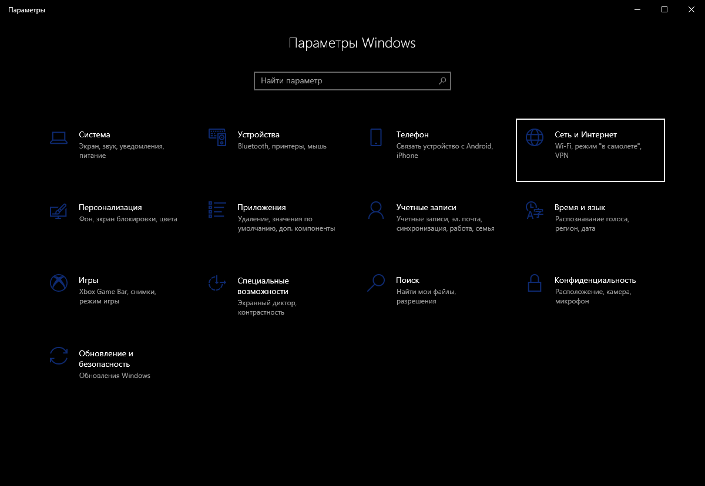
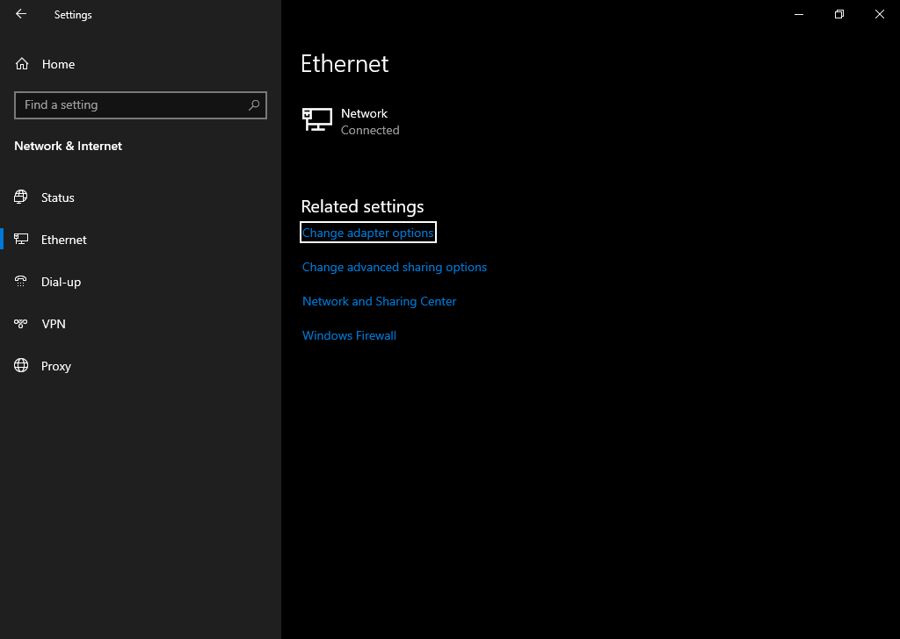
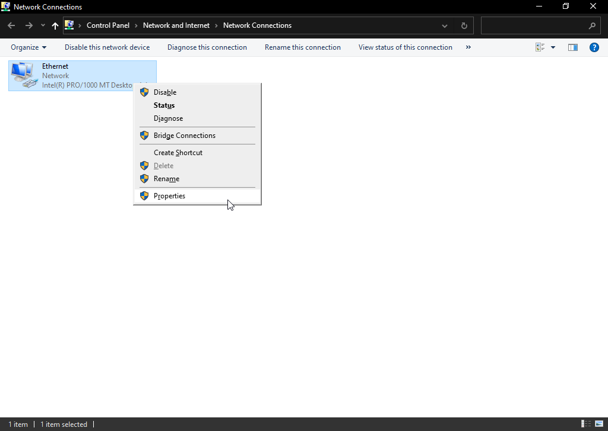
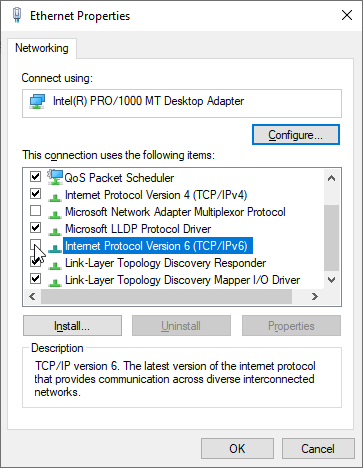

# 🔘 無效的IPv6 (Invalid IPv6)

如果你卡在連線至主伺服器頁面，而ping `api.battlebit.cloud` 回傳的結果為無效的IPv6 (Invalid IPv6)，請依系統版本進行以下步驟:

Windows 10

1. 於系統設定中點選 「網路與網際網路」。

2. 依你的連線種類選擇Wifi或乙太網路，並選擇「變更介面卡選項」。

3. 右鍵點選你使用的介面卡，並點選內容。

5. 將 「網際網路通訊協定第6版 (TCP/IPv6)」取消勾選，並點選確定。

Windows 11

1. 於系統設定中點選 「網路與網際網路」。

2. 點選「進階網路設定」。

3. 向下滑並點選「更多網路介面卡選項」

4. 右鍵點選你使用的介面卡，並點選內容。

4. 將 「網際網路通訊協定第6版 (TCP/IPv6)」取消勾選，並點選確定。

