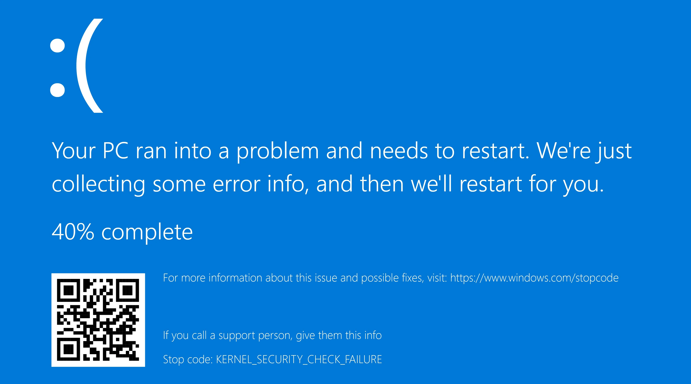

# 🔘 BSoD on game launch (139)

<figure><figcaption></figcaption></figure>

Usually, cause of this issue is `EasyAntiCheat_EOS.sys` driver. To fix it, you need to [run sfc/dism](../other/running-sfc-dism.md) and [EAC fix batch](https://github.com/livingflore/BattleBitEACFix/releases).
