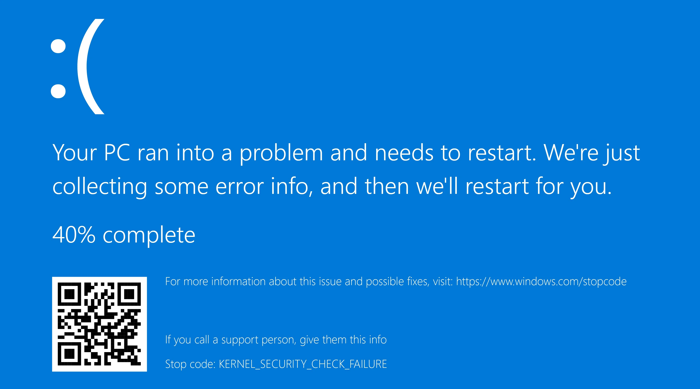

# 🔘 遊戲啟動後藍屏當機 (139)

<figure><figcaption></figcaption></figure>

這通常是 `EasyAntiCheat_EOS.sys` 驅動程式造成的問題。 請執行 [sfc/dism](../other/running-sfc-dism.md) 與 [EAC修復工具](https://github.com/livingflore/BattleBitEACFix/releases)

