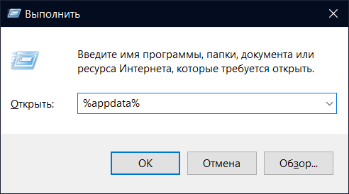
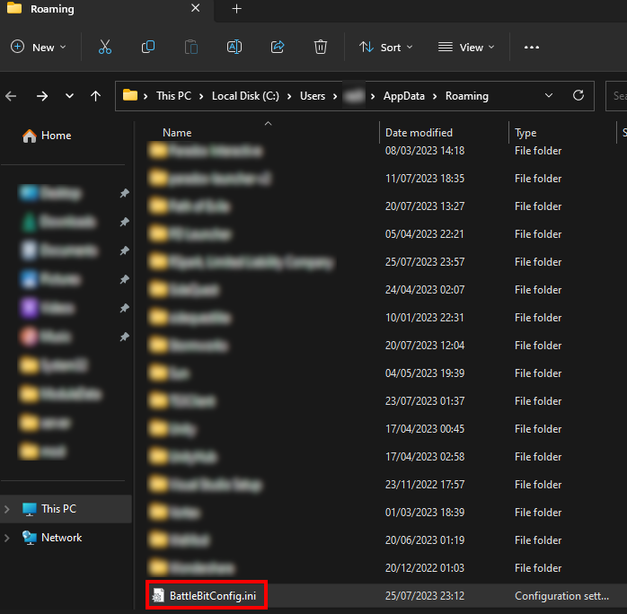
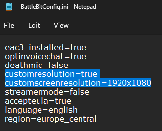

# 🔘 I set my in-game resolution wrong and BattleBit keeps crashing

Step 1: Press the Windows key + R on your keyboard to open the Run dialog box. Type '%appdata%' into the box and press "OK":

<figure><figcaption>
Run prompt
</figcaption></figure>

Step 2: In the File Explorer window that opens, search for and open a file named "BattleBitConfig.ini":

<figure><figcaption>
AppData/Roaming folder
</figcaption></figure>

Step 3: Locate the resolution line within this file and adjust it to match your monitor's settings:

<figure><figcaption>
BattleBit config file
</figcaption></figure>

Step 4: Save the changes, close the file, and restart the game.
