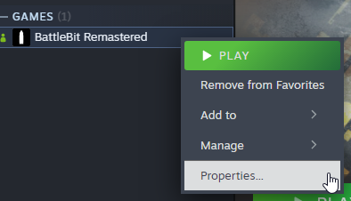
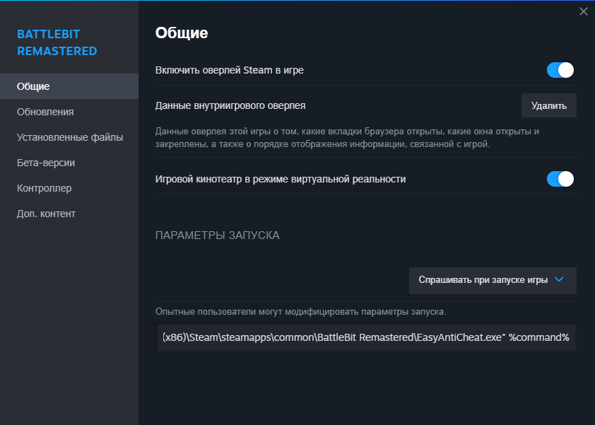

# 🔘 Launch from Steam

If you experience this problem:

1. Navigate to launch options by right clicking the game and pressing "Properties...".

<figure><figcaption></figcaption></figure>

2. Paste this in your launch options (replace your game path if it's different):\
   `"C:\Program Files (x86)\Steam\steamapps\common\BattleBit Remastered\EasyAntiCheat.exe" %command%`&#x20;

<figure><figcaption>
It should look like this. If your game path differs - replace it with your actual game path.
</figcaption></figure>
