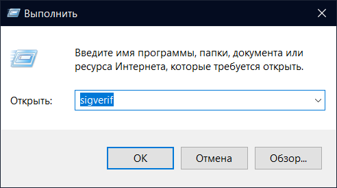
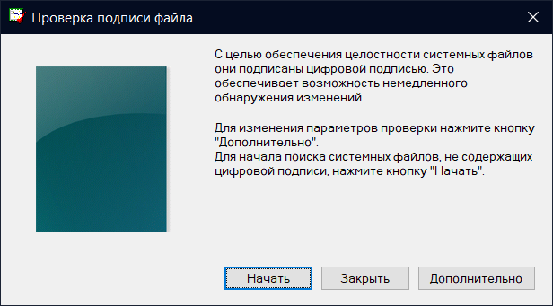

# 🔘 Game Security Violation Detected

<figure><figcaption></figcaption></figure>

Если вы наблюдаете ошибку с кодом #0000000D, избавьтесь от процесса который мешает запуску EAC (имя процесса в квадратных скобках). Для других кодов, шаги по устранению ошибки универсальны:

1. Проверьте список процессов в диспетчере задач и избавьтесь от всего, что может мешать EAC (RGB софт для мышек/клавиатур/корпусов, скрипты для скрытия программ в трей, различные твики и т.д.).
2. Если вы используете сторонний антивирус - убедитесь, что вы добавили EAC в его исключения. Если это не поможет - попробуйте удалить антивирус, чтобы проверить, уйдет ли проблема.
3. Запустите [EAC Fix batch](https://github.com/livingflore/BattleBitEACFix/releases) (файл BattleBitEACFix.bat).
4. Попробуйте запустить `BattleBitEAC.exe` или `EasyAntiCheat.exe` (расположены в папке с игрой) от имени администратора.

<figure><figcaption>
Нажмите ПКМ по игре, затем "Управление" и "Просмотреть локальные файлы"
</figcaption></figure>

<figure><figcaption>
Нажмите ПКМ по исполняемому файлу и "Запуск от имени администратора"
</figcaption></figure>

5. Проверьте целостность файлов игры.

<figure><figcaption>
Нажмите ПКМ по игре, затем "Свойства...", перейдите во вкладку "Установленные файлы" и нажмите "Проверить целостность файлов игры".
</figcaption></figure>

5. Включите [Защиту от выполнения данных](https://support.microsoft.com/ru-ru/topic/%D1%87%D1%82%D0%BE-%D1%82%D0%B0%D0%BA%D0%BE%D0%B5-%D0%B7%D0%B0%D1%89%D0%B8%D1%82%D0%B0-%D0%BE%D1%82-%D0%B2%D1%8B%D0%BF%D0%BE%D0%BB%D0%BD%D0%B5%D0%BD%D0%B8%D1%8F-%D0%B4%D0%B0%D0%BD%D0%BD%D1%8B%D1%85-dep-60dabc2b-90db-45fc-9b18-512419135817).
6. Проверьте подписи драйверов.

<figure><figcaption>
Нажмите Win+R, введите <code>sigverif</code> и нажмите ОК.
</figcaption></figure>

<figure><figcaption>
Нажмите "Начать" и ожидайте окончания работы программы.
</figcaption></figure>

После того, как проверка завершится, возможно два варианта развития событий: вам покажет список тех драйверов, которые не имеют подписи или [сообщение](https://i.imgur.com/XrZkKlW.png) о том, что все подписи в порядке. В первом случае, в зависимости от того какие драйвера не подписаны, потребуется [переустановить](https://support.nzxt.com/hc/ru/articles/4403882406555-%D0%9F%D0%B5%D1%80%D0%B5%D1%83%D1%81%D1%82%D0%B0%D0%BD%D0%BE%D0%B2%D0%BA%D0%B0-%D0%B3%D1%80%D0%B0%D1%84%D0%B8%D1%87%D0%B5%D1%81%D0%BA%D0%B8%D1%85-%D0%B4%D1%80%D0%B0%D0%B9%D0%B2%D0%B5%D1%80%D0%BE%D0%B2)/обновить драйвера видеокарты или [запустить sfc/dism](../other/running-sfc-dism.md).
