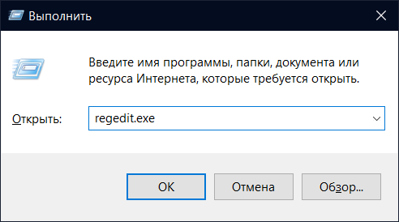
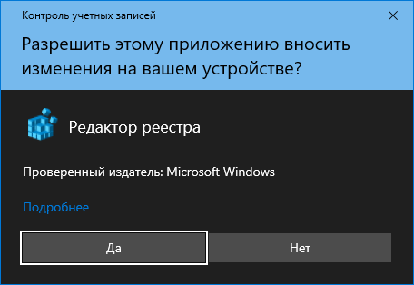
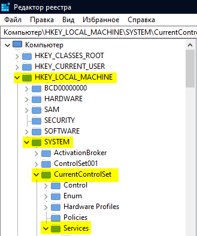
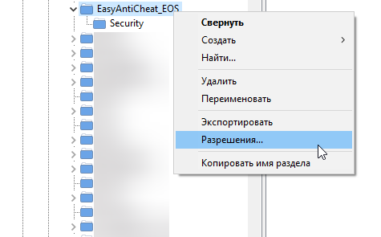
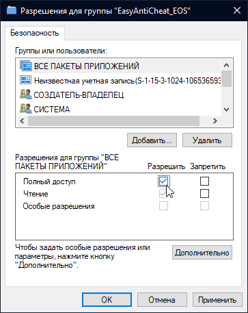

# 🔘 StartService EasyAntiCheat\_EOSSys failed with 5.

<figure><figcaption></figcaption></figure>

1. Запустите [EAC Fix batch](https://github.com/livingflore/BattleBitEACFix/releases) (файл BattleBitEACFix.bat).
2. Выдайте EAC полный доступ для всех пакетов приложений в реестре.

<figure><figcaption>
Нажмите Win+R, введите <code>regedit.exe</code> и нажмите Enter.
</figcaption></figure>

<figure><figcaption>
Нажмите Да.
</figcaption></figure>

<figure><figcaption>
Проследуйте по пути <code>HKEY_LOCAL_MACHINE\SYSTEM\CurrentControlSet\Services\EasyAntiCheat_EOS</code>.
</figcaption></figure>

<figure><figcaption>
Нажмите ПКМ по папке <code>EasyAntiCheat_EOS</code>.
</figcaption></figure>

<figure><figcaption>
Нажмите на галочку "полный доступ" под группой "ВСЕ ПАКЕТЫ ПРИЛОЖЕНИЙ".
</figcaption></figure>
