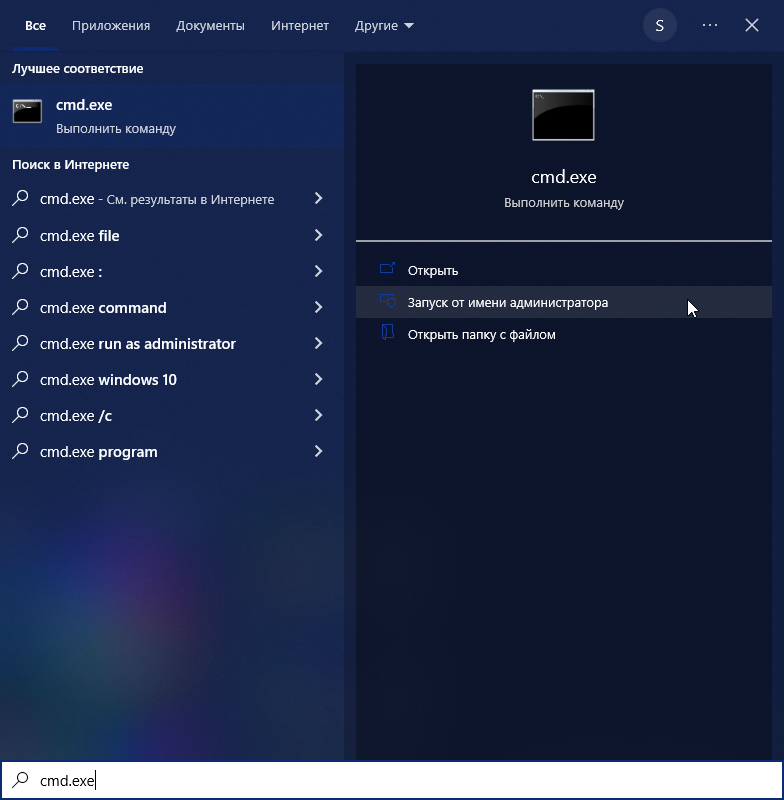
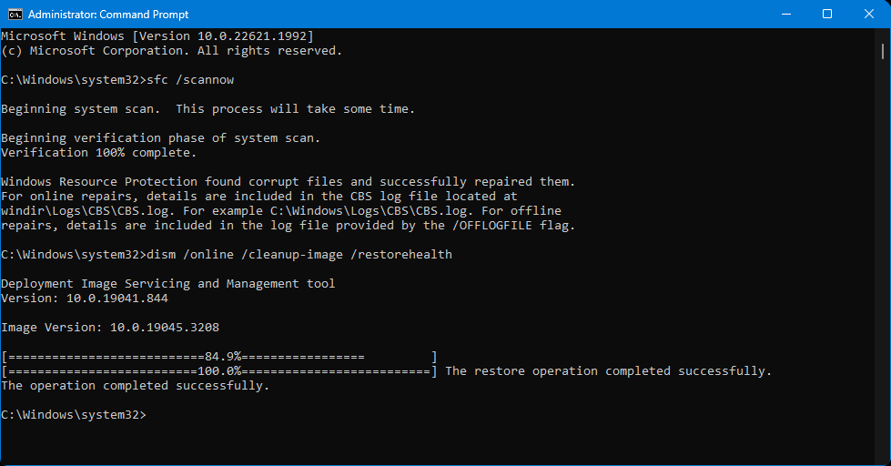
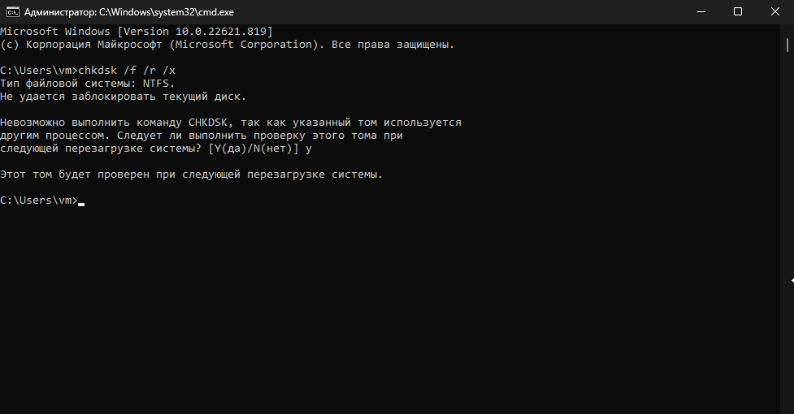
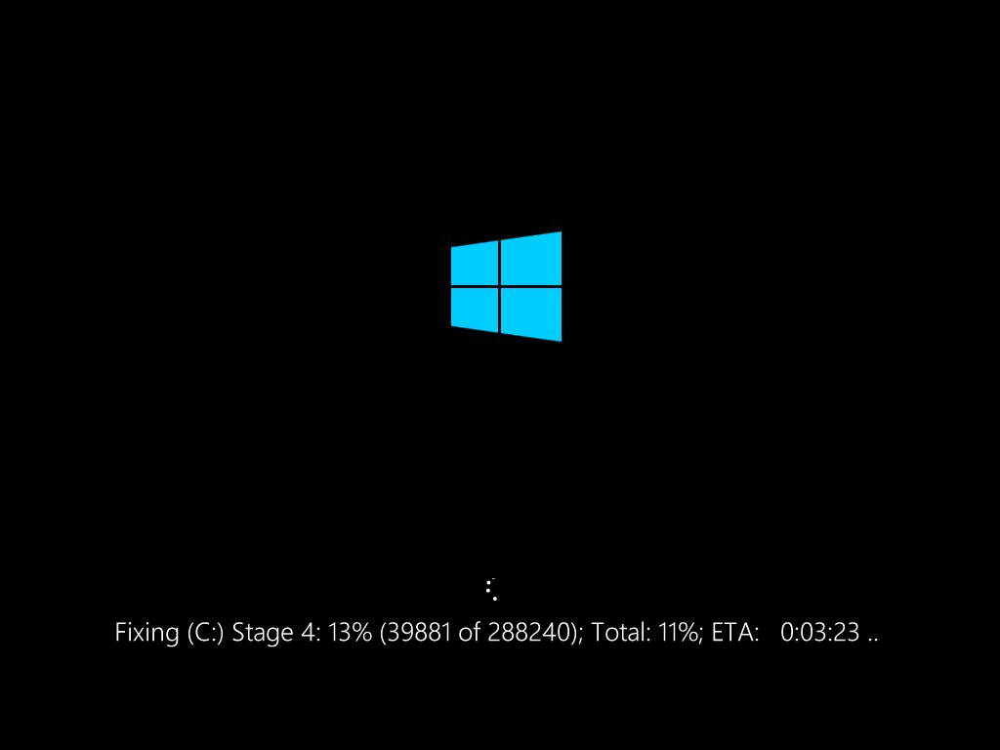

# 🔘 Running sfc/dism

1. Run command prompt as administrator.

<figure><figcaption>
Type <code>cmd.exe</code> in search and press "Run as administrator".
</figcaption></figure>

2. Run next commands in order:\
   `sfc /scannow`\
   `dism /online /cleanup-image /restorehealth`\
   `dism /online /cleanup-image /scanhealth` \
   `dism /online /cleanup-image /restorehealth`

<figure><figcaption>
That's how command prompt should look after both sfc and dism finished.
</figcaption></figure>

3. After it's finished, additionally you can run `chkdsk /f /r /x` to check your drive for corruptions.

<figure><figcaption></figcaption></figure>

After you'll press Y, reboot your PC.

<figure><figcaption></figcaption></figure>
